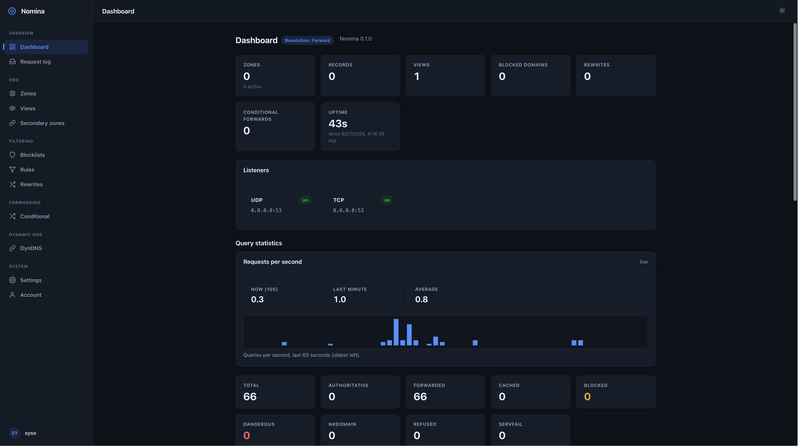
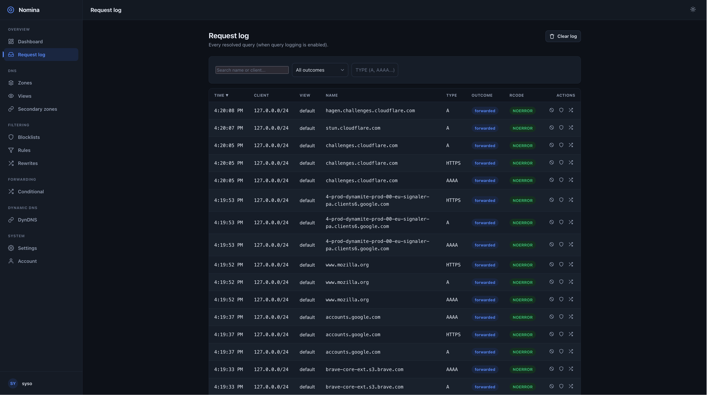
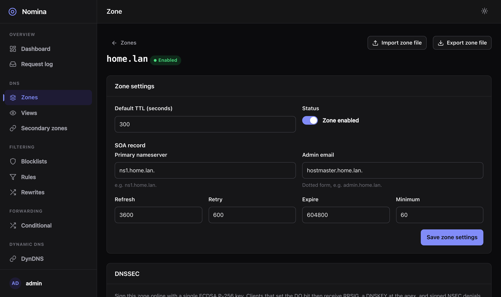
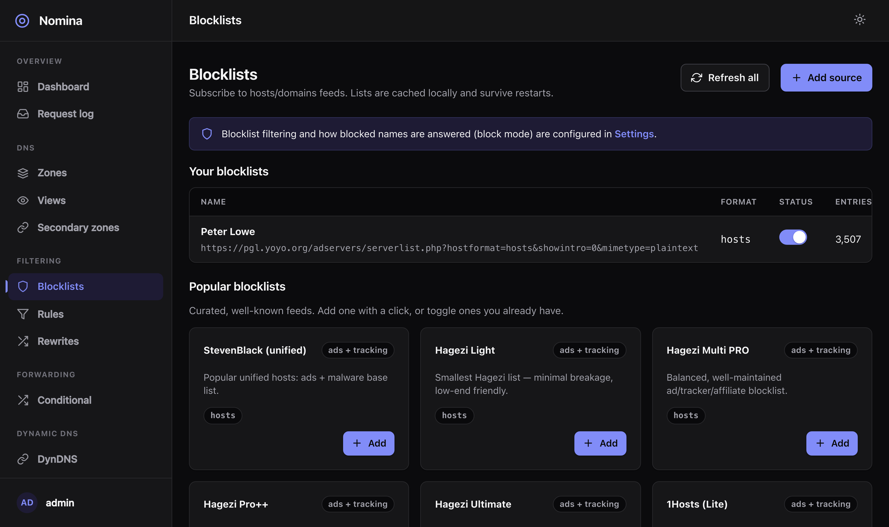
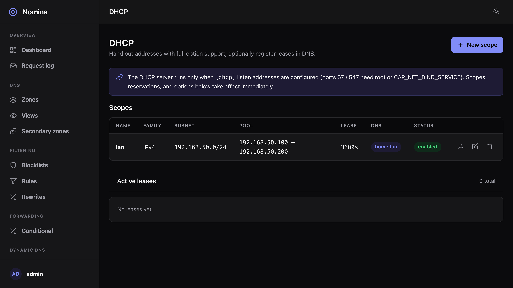

# Nomina

A secure, split-horizon DNS server for homelabs and small networks — in a
**single self-contained Rust binary**. Nomina is authoritative for your own
zones, forwards or recurses for everything else, blocks ads and trackers like
Pi-hole, speaks the modern encrypted transports, and ships with a web UI and a
JSON API.

```sh
cargo build --release
./target/release/nomina --dns-listen 0.0.0.0:53 --web-listen 127.0.0.1:8053
```

<p align="center">
  
</p>

<table>
  <tr>
    <td width="50%"><br><sub><b>Request log</b> — paginated, filterable, with one-click block / allow / rewrite.</sub></td>
    <td width="50%"><br><sub><b>Zone editor</b> — structured per-type records, SOA, and per-zone DNSSEC signing.</sub></td>
  </tr>
  <tr>
    <td width="50%"><br><sub><b>Blocklists</b> — one-click subscribe from a catalog of ~20 well-known lists.</sub></td>
    <td width="50%"><br><sub><b>DHCP</b> — IPv4/IPv6 scopes, reservations, leases, and full options.</sub></td>
  </tr>
</table>

## Why Nomina

Most DNS tools pick a side. Authoritative servers (BIND, Knot, NSD, PowerDNS,
CoreDNS) serve your zones but don't block ads or ship a UI. Filtering resolvers
(Pi-hole, AdGuard Home, Blocky) block ads but aren't authoritative — no real
zones, DNSSEC signing, or zone transfers. **Nomina does both**, adds
split-horizon **views** as a first-class concept, speaks DoT/DoH/DoQ/DoH3, and is
one static binary with the database and web UI embedded.

## Features

- **Split-horizon views** — serve different records per client CIDR (`nas.home.lan`
  → `10.0.0.5` inside, `203.0.113.5` outside).
- **Authoritative + resolver** — your zones served authoritatively; everything
  else **forwarded** (UDP/TCP/DoT/DoH), **recursed** from the roots, or refused
  (authoritative-only mode). Edge answer cache in front of upstream.
- **20 record types** with structured per-type fields: A, AAAA, ANAME, CAA, CERT,
  CNAME, CSYNC, HINFO, HTTPS, MX, NAPTR, NS, OPENPGPKEY, PTR, SMIMEA, SRV, SSHFP,
  SVCB, TLSA, TXT (+ SOA via zone settings).
- **Filtering** — subscribe to ~20 well-known blocklists (Hagezi, OISD,
  StevenBlack, URLhaus, Phishing Army…), manual allow/deny rules, AdGuard-style
  rewrites, and **IDN-homograph** phishing protection. Block with NXDOMAIN,
  `0.0.0.0`, or REFUSED.
- **DNSSEC** — opt-in per-zone online **signing** (ECDSA P-256, NSEC/NSEC3) with
  DS/DNSKEY export, plus optional **upstream validation**.
- **GeoDNS, load balancing & ASN filtering** — views can match clients by
  country/continent/ASN (with optional MaxMind GeoLite2 databases); round-robin /
  random load balancing across multi-address answers; reject traffic by ASN.
- **Encrypted transports** — DNS-over-TLS, DNS-over-HTTPS (RFC 8484), DNS-over-QUIC
  (RFC 9250), and DNS-over-HTTP/3.
- **Zone transfers** — serve AXFR/IXFR to allow-listed secondaries, act as a
  secondary (SOA-driven refresh), optional **TSIG**; import/export BIND files.
- **DynDNS** — DynDNS2 `/nic/update` endpoint for routers/clients (ddclient,
  FRITZ!Box, UniFi, No-IP), with per-client hostname-scoped tokens. Client setup:
  [`docs/dyndns-clients.md`](docs/dyndns-clients.md).
- **DHCP (IPv4 + IPv6)** — scopes, pools, static reservations (MAC/DUID), the
  full option set plus arbitrary user-defined options, persistent leases, and
  optional lease → DNS auto-registration (A/AAAA + PTR). Off until configured.
- **Observability** — dashboard (req/s, latency, cache hit-rate, per-outcome and
  DNSSEC-failure counts), a searchable request log, and Prometheus `/metrics`.
- **Secure & private by default** — argon2 logins, server-side sessions, CSRF,
  strict CSP, privilege dropping, optional management allow-list; query logging
  **off by default** (or anonymized / full).

## How it compares

A fair, conservative snapshot — features change, so check each project's docs.
Nomina's distinguishing trait is the *combination* below in one Rust binary.
[Technitium DNS](https://technitium.com/dns/) is the closest single-app
comparison and is more mature and battle-tested.

| Capability | Nomina | Pi-hole | AdGuard Home | Technitium | BIND 9 | CoreDNS |
|---|:--:|:--:|:--:|:--:|:--:|:--:|
| Authoritative zones (full types) | ✅ | partial¹ | partial¹ | ✅ | ✅ | ✅ |
| Split-horizon views | ✅ | ❌ | partial² | ✅ | ✅ | plugin |
| Recursive resolver | ✅ | via Unbound | ❌ | ✅ | ✅ | ❌ |
| Ad/tracker filtering | ✅ | ✅ | ✅ | ✅ | RPZ | plugin |
| DNSSEC validation | ✅ | via Unbound | ✅ | ✅ | ✅ | ❌ |
| DNSSEC signing | ✅ | ❌ | ❌ | ✅ | ✅ | plugin |
| DoT/DoH/DoQ **server** | ✅ | ❌³ | ✅ | ✅ | DoT/DoH⁴ | DoT/DoH |
| AXFR / secondary | ✅ | ❌ | ❌ | ✅ | ✅ | plugin |
| DynDNS HTTP update | ✅ | ❌ | ❌ | partial⁵ | RFC 2136⁵ | ❌ |
| Built-in web UI | ✅ | ✅ | ✅ | ✅ | ❌ | ❌ |
| Single self-contained binary | ✅ | ❌ | ✅ | ❌⁶ | ❌ | ✅ |
| DHCP server (v4 + v6) | ✅ | ✅ | ✅ | ✅ | ❌ | ❌ |
| Language | Rust | C/PHP | Go | C#/.NET | C | Go |

<sub>¹ local records/rewrites, not full zones/DNSSEC-signing/AXFR. ² client-specific
rules, not CIDR views. ³ needs a separate proxy. ⁴ BIND 9.18+. ⁵ Technitium via
its API; BIND via RFC 2136 — neither is the HTTP DynDNS2 protocol routers speak.
⁶ runs on .NET.</sub>

**Caveat:** Nomina is young — it lacks the maturity and scale hardening of
BIND/Technitium. For a pure recursor, Unbound is lighter; for
authoritative-at-scale, Knot/NSD are battle-tested.

## Quick start

```sh
cargo build --release
# DNS on a high port + UI locally (no root needed):
./target/release/nomina --dns-listen 127.0.0.1:5353 --web-listen 127.0.0.1:8053
dig @127.0.0.1 -p 5353 nas.home.lan A
```

Open `http://127.0.0.1:8053`, create the admin account, then add a zone, records,
and views.

Operational state lives in the database (SQLite, auto-migrated). Listen sockets,
TLS, bind addresses, and privileges come from a TOML file — see
[`nomina.example.toml`](nomina.example.toml). Key flags override it:
`--dns-listen`/`--dot-listen`/`--doh-listen`/`--doq-listen`/`--doh3-listen`
(repeatable), `--web-listen`, `--web-tls`, `--hostname`, `--data-dir`, `--log`.

For privileged ports, run as root with a `[privileges]` user/group — Nomina binds
the sockets, then drops privileges (or grant `CAP_NET_BIND_SERVICE` under
systemd). The full config reference is in
[`nomina.example.toml`](nomina.example.toml).

For a publicly-reachable instance, set `tls.acme = true` to get and auto-renew a
real **Let's Encrypt** certificate for the web UI (ACME TLS-ALPN-01) — no manual
certs. Otherwise a self-signed cert is generated under `data_dir`.

## Architecture

The DNS hot path reads an in-memory store (zones/records/views) and filter set,
rebuilt from SQLite and atomically swapped on change — queries never block on the
database. All transports funnel through one core:
**local zones → rewrite → allow → block → conditional forward → upstream →
REFUSED**. Persistence is Diesel + bundled SQLite with versioned migrations.
The release build keeps unwinding panics so a malformed packet can't abort the
process. The JSON API contract is the source of truth at
[`docs/api-contract.md`](docs/api-contract.md).

## Roadmap

Native packages (deb/rpm) and a container image · clustering / HA · DHCP relay
and PXE conveniences.

## Contributing

PRs welcome. Run `cargo fmt`, `cargo clippy`, and `cargo test` first, and update
`docs/api-contract.md` alongside any API change.

## License

Licensed under either [Apache-2.0](LICENSE-APACHE) or [MIT](LICENSE-MIT) at your
option.
